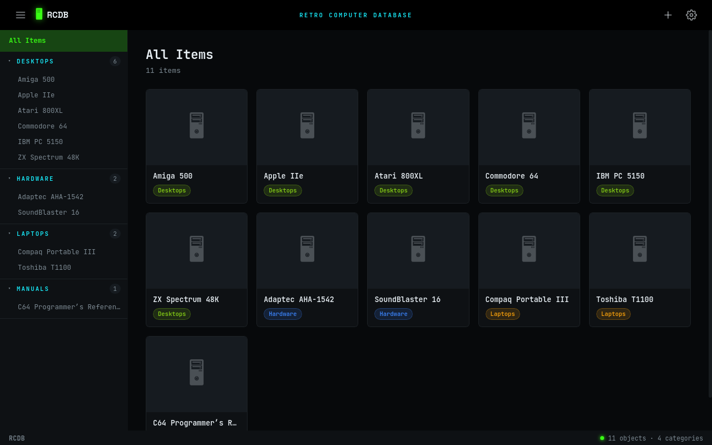

# RCDB — Retro Computer Database



> ⚠️ **Disclaimer:** This is a Claude Code "vibe coding" project. It was built
> iteratively with the [Claude Code](https://claude.com/claude-code) AI agent
> and is intended for personal/experimental use on a trusted network. Review the
> code before relying on it. See [SECURITY.md](SECURITY.md) for the threat model.

A personal inventory system for retro computer enthusiasts. Track your vintage desktops, laptops, hardware components, peripherals and manuals — complete with photos, specifications, notes and file attachments — all in a clean dark-mode dashboard.

## Features

- **Themeable dashboard** (Neon · Classic · Light) with a collapsible category sidebar
- **Four categories out of the box:** Desktops · Laptops · Hardware · Manuals
- **Desktop & Laptop specifications** — structured forms with hardware-linked dropdowns (processor, memory, videocard, etc.) and laptop-specific fields (screen, battery, touchpad)
- **Hardware inventory** with 11 pre-defined types, each with type-specific fields:
  - Processor, Memory, Hard Drive, Videocard, Soundcard
  - Network card, Controller card, Floppy Drive, Optical Drive
  - Peripheral (keyboard, mouse, joystick), Monitor
- **Hardware linking** — assign components from your hardware pool directly to a desktop
- **Approx. Era** year selector on Desktops and Laptops (1970 → present)
- **Photo galleries** with lightbox viewer and arrow-key navigation
- **Manuals** — attach PDF, Word, Markdown or plain text files; read them in a built-in viewer; link manuals to any machine
- **Per-item notes and task lists**
- **Export / Import** database backup
- **Reset** — wipe all data and start fresh from Settings

---

## Installation

### Option A — Docker Compose (recommended)

```bash
docker compose up -d --build
```

Open `http://localhost:8031` in your browser. (The container listens on `8080`
internally; `docker-compose.yml` maps it to `8031` on the host — change the left
side of the `ports` mapping if you'd prefer a different host port.)

Your data lives in the `rcdb_data` Docker volume (mounted at `/data` inside the
container), so it survives rebuilds and container removal. The container reports
its health via `/healthz` — check it with `docker compose ps`.

**Optional password:** RCDB runs open by default (intended for a trusted LAN).
To require a login, set `RCDB_PASSWORD` in `docker-compose.yml` and recreate the
container. See [Maintenance & operations](#maintenance--operations).

---

### Option B — Run locally (development / testing)

```bash
pip install -r requirements.txt
DB_PATH=/tmp/rcdb.db python app.py
```

Open `http://localhost:8080`.

---

## Maintenance & operations

### Update / rebuild

After pulling new code, rebuild and restart in one step:
```bash
docker compose up -d --build
```
Stop with `docker compose down` (the `rcdb_data` volume is kept).

### Back up & restore

Your entire dataset — items, specs, notes, tasks, **and** embedded photos/files —
lives in a single SQLite file in the `rcdb_data` volume.

- **In-app:** Settings → **Data** → **Export** downloads `rcdb.db`; **Import**
  restores one (this *replaces* all current data).
- **From the host** (app can keep running):
  ```bash
  # Back up
  docker run --rm -v rcdb_rcdb_data:/data -v "$PWD":/backup alpine \
    cp /data/rcdb.db /backup/rcdb-backup.db
  # Restore
  docker compose down
  docker run --rm -v rcdb_rcdb_data:/data -v "$PWD":/backup alpine \
    cp /backup/rcdb-backup.db /data/rcdb.db
  docker compose up -d
  ```
  (Compose names the volume `<project>_rcdb_data`, i.e. `rcdb_rcdb_data`.)

Always take a backup before using **Import**.

### Enable a password

Set `RCDB_PASSWORD` in the `environment:` block of `docker-compose.yml`, then
`docker compose up -d`. HTML pages then redirect to a login form and the API
returns `401` until you sign in; there is a per-IP lockout after repeated
failures. If you expose RCDB beyond a trusted LAN, also put it behind HTTPS and
set `SESSION_COOKIE_SECURE=True` in `rcdb/__init__.py`. Upload size is capped at
64 MB (`RCDB_MAX_UPLOAD_MB`).

### Run the tests

```bash
python -m venv .venv && .venv/bin/pip install -r requirements-dev.txt
.venv/bin/pytest
```
The suite (in `tests/`) runs against an isolated temp database and covers pages,
CRUD, media, import/export and the security controls.

---

## How to use RCDB

### Adding items

1. Click **＋ New Object** in the top bar to add an item to any category.
2. For **Hardware** items, also select the hardware type (Processor, Videocard, etc.).
3. When in a filtered category view (e.g. Desktops), an **Add Desktop** button appears for one-click creation with the category pre-selected.

### Specifications

- **Desktops** — structured form with dropdowns that link directly to hardware items in your Hardware inventory. Memory and Operating System are free-text.
- **Laptops** — same structure but all free-text (no hardware linking), with additional fields: Screen, Mouse/Touchpad, Battery, Special ports.
- **Hardware** — type-specific form based on the hardware type selected (e.g. Hard Drive shows Interface, Capacity, RPM, Form factor).
- **Appx. Era** — a year selector (1970 → present) on Desktops and Laptops to record the approximate period a machine was in use.

### Photos

Each Desktop, Laptop and Hardware item has a photo gallery below the Specifications section. Click **＋ Add photos** to upload multiple images. Click any thumbnail to open the lightbox viewer; navigate with **← →** arrow keys or on-screen buttons.

### Manuals

The Manuals category stores digital manuals. Each manual can have:
- A **URL** linking to the manual online
- One or more **files** (PDF, Word, Markdown, plain text)

Click the **👁** button next to a file to read it in the built-in viewer:
- PDFs render in a native PDF viewer
- Markdown is rendered with full formatting
- Plain text shows in a monospace reader
- Word documents prompt for download

Link manuals to any Desktop, Laptop or Hardware item using the **Manuals** section on the item page. Multiple manuals can be linked to a single item (e.g. service manual + user manual). The **↗** button jumps to the manual item; the **👁** button opens the reader directly.

### Hardware linking

When you add hardware items (e.g. "Seagate ST251" as a Hard Drive), they become available in the dropdown selectors on Desktop items. Link your actual physical hardware to specific machines — and use the **↗** button to jump from the Desktop's spec to the hardware item's full detail page.

### Settings

Open **Settings** (⚙ in the top bar). It is organised into tabs:
- **Categories** — add, rename or delete categories
- **Appearance** — pick a colour theme (Neon · Classic · Light); the choice is
  remembered in your browser
- **Data** — **Export** a full backup as `rcdb.db`, **Import** a backup (replaces
  all current data), or **Reset** everything (requires typing RESET to confirm)

---

## Technical details

| Detail | Value |
|---|---|
| Backend | Python 3.12 + Flask |
| Database | SQLite (stored in the `/data` volume) |
| Port | `8080` |
| Data path | `/data/rcdb.db` (override with the `DB_PATH` env var) |

---

## Project structure

The app is a small Flask package behind a thin entrypoint:

```
rcdb/
├── app.py                    # entrypoint: create_app() + dev server
├── rcdb/                     # application package
│   ├── __init__.py           # app factory: config, logging, security wiring
│   ├── config.py             # env settings + session secret
│   ├── db.py                 # connection, schema, category helpers
│   ├── hardware.py           # hardware-type templates & spec layouts
│   ├── helpers.py            # id slug + Jinja filters/context
│   ├── security.py           # MIME neutralisation, headers, CSRF, auth
│   └── routes/               # one blueprint per resource
│       ├── pages.py          #   index + item detail (HTML)
│       ├── auth.py           #   optional login/logout
│       ├── health.py         #   /healthz
│       ├── items.py  categories.py  notes.py  tasks.py  specs.py
│       ├── media.py          #   cover + gallery photos
│       ├── manuals.py        #   manual files + item↔manual links
│       └── data.py           #   export / import / reset
├── templates/                # base.html · index.html · item.html · login.html
├── static/                   # style.css · favicon.svg
├── tests/                    # pytest suite (isolated temp DB per test)
├── Dockerfile · docker-compose.yml
├── requirements.txt · requirements-dev.txt
└── SECURITY.md               # threat model, findings, recommendations
```

---

## Built with

| Component | Technology |
|---|---|
| Backend | Python 3.12 · Flask 3.1 · SQLite |
| Frontend | Vanilla HTML/CSS/JavaScript · Jinja2 templates |
| Packaging | Docker · Docker Compose |
| Markdown rendering | [marked.js](https://marked.js.org/) |

---

## Disclaimer

This application was **fully designed and built using [Claude Code](https://claude.ai/code)** (nicknamed **ClaudyBuddy** by its owner). Every feature — from the database schema and Flask routes to the dark-mode UI, hardware type templates, lightbox gallery, Docker packaging and this README — was created through an interactive conversation with Claude Code by Anthropic.

The app was built entirely without writing a single line of code manually, demonstrating what AI-assisted development can achieve for personal software projects.

---

## License

MIT — do whatever you like with it.
